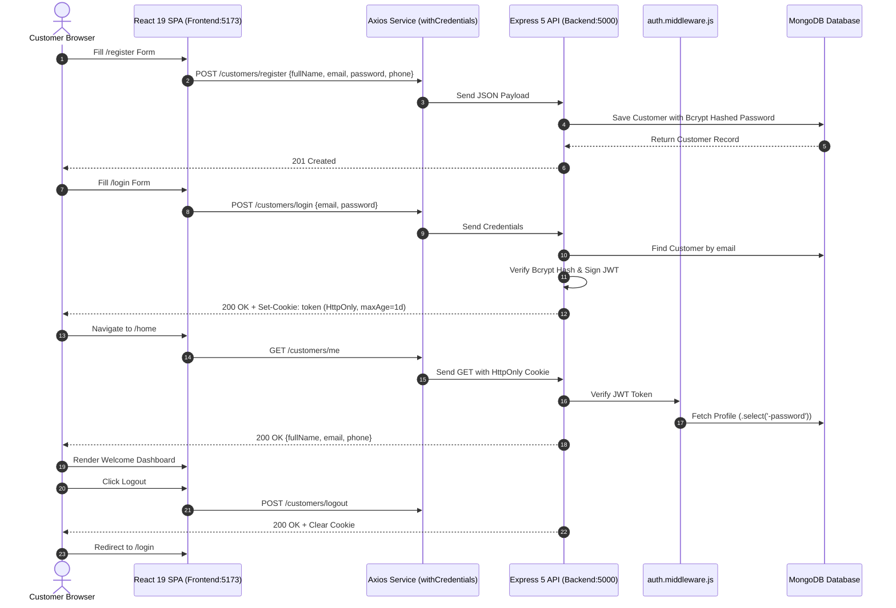

# ShopKart — Full-Stack Customer Portal & Authentication System 🛒

> **Production-grade decoupled full-stack application featuring a Node.js, Express 5 & MongoDB backend paired with a React 19 & Vite 8 frontend, implementing secure JWT authentication stored in `HttpOnly` cookies.**

[](https://react.dev)
[](https://vite.dev)
[](https://expressjs.com)
[](https://www.mongodb.com)
[](LICENSE)
[](docs/CONTRIBUTING.md)

---

## 📌 What is ShopKart?

**ShopKart** is an open-source full-stack customer authentication and product catalog platform. Designed around security best practices, ShopKart isolates authentication tokens inside `HttpOnly` browser cookies, preventing client-side script access (`document.cookie`) and mitigating Cross-Site Scripting (XSS) attacks. The platform seamlessly integrates customer registration, login verification, protected profile sessions, product catalog browsing, and session invalidation.

---

## ✨ Key Features

- 🔐 **Secure JWT Session Management**: Tokens signed with 1-day expiration and delivered via `HttpOnly` cookies.
- 🔑 **Bcrypt Password Security**: Passwords hashed using bcrypt (10 salt rounds) prior to storage; omitted from queries (`.select('-password')`).
- 🛡️ **Protected Route Middleware**: Server-side Express middleware (`auth.middleware.js`) verifying token signature before returning protected profile data.
- 🛍️ **E-Commerce Product Catalog**: Search, filter by category, view product stock status, and inspect detailed product views.
- ⚛️ **React 19 Controlled Components**: Responsive forms managed via `useState`, client-side routing via React Router 7, and component lifecycle handlers.
- 🌐 **Automated Axios Cookie Delivery**: Configured with `withCredentials: true` for automatic cross-origin cookie transmission.

---

## 🏗️ Architecture & Authentication Flow



---

## 🛠️ Tech Stack

| Layer | Technology | Description |
| :--- | :--- | :--- |
| **Backend Runtime** | [Node.js](https://nodejs.org) | Asynchronous JavaScript runtime environment |
| **Backend Framework** | [Express 5.2](https://expressjs.com) | RESTful API server framework |
| **Database & ODM** | [MongoDB](https://mongodb.com) / [Mongoose 9.9](https://mongoosejs.com) | NoSQL document database & ODM schema modeling |
| **Auth & Encryption** | `bcrypt`, `jsonwebtoken`, `cookie-parser` | Salted password hashing, JWT signing, cookie parsing |
| **Frontend Framework** | [React 19.2](https://react.dev) | UI component library with hooks (`useState`, `useEffect`) |
| **Build Tooling** | [Vite 8.2](https://vite.dev) | Lightning-fast HMR dev server & production bundler |
| **Client Routing** | [React Router 7.18](https://reactrouter.com) | Client-side page navigation & protected route redirects |
| **HTTP Client** | [Axios 1.20](https://axios-http.com) | HTTP client configured with `withCredentials: true` |
| **Static Analysis** | [Oxlint 1.79](https://oxc.rs) | High-speed JavaScript/JSX code linter |

---

## 📂 Project Structure

```text
ShopKart/
├── .github/
│   ├── ISSUE_TEMPLATE/
│   │   ├── bug_report.md         # Standardized bug reporting form
│   │   └── feature_request.md    # Feature proposal template
│   ├── workflows/
│   │   └── ci.yml                # Automated backend & frontend GitHub Actions CI
│   ├── CODEOWNERS                # Maintainer code ownership definitions
│   ├── PULL_REQUEST_TEMPLATE.md  # Contributor PR submission checklist
│   └── dependabot.yml            # Automated dependency update configuration
├── docs/
│   ├── GETTING_STARTED.md        # Step-by-step setup and local running guide
│   ├── ARCHITECTURE.md           # Sequence flow, module breakdown & database schema
│   ├── DEVELOPMENT.md            # Developer commands, linting & build scripts
│   ├── CONTRIBUTING.md           # Contributor guidelines and workflow
│   ├── SECURITY.md               # Session security safeguards & vulnerability reporting
│   └── FAQ.md                    # Frequently asked technical questions
├── backend/
│   ├── controllers/
│   │   ├── customer.controller.js # Auth request handlers (register, login, me, logout)
│   │   └── product.controller.js  # Product catalog request handlers
│   ├── middlewares/
│   │   └── auth.middleware.js     # JWT cookie verification middleware
│   ├── models/
│   │   ├── customer.model.js      # Customer Mongoose schema
│   │   └── product.model.js       # Product Mongoose schema
│   ├── routes/
│   │   ├── customer.routes.js     # Customer endpoint routes
│   │   └── product.routes.js      # Product endpoint routes
│   ├── utils/
│   │   └── generateToken.js       # JWT signing & HttpOnly cookie configuration
│   ├── .env.example               # Backend environment configuration template
│   ├── index.js                   # Express server entry point & MongoDB connection
│   └── package.json               # Backend dependencies & scripts
├── frontend/
│   ├── src/
│   │   ├── components/
│   │   │   ├── Navbar.jsx         # Top navigation bar
│   │   │   ├── ProductCard.jsx    # Product card preview component
│   │   │   └── SearchBar.jsx      # Product search & category filter bar
│   │   ├── pages/
│   │   │   ├── Home.jsx           # Protected profile page (/home)
│   │   │   ├── Login.jsx          # Customer login page (/login)
│   │   │   ├── ProductDetails.jsx # Detailed product view (/products/:id)
│   │   │   ├── Products.jsx       # Product catalog page (/products)
│   │   │   └── Register.jsx       # Registration page (/register)
│   │   ├── services/
│   │   │   └── api.js             # Axios instance with withCredentials: true
│   │   ├── App.jsx                # Router configuration
│   │   ├── index.css              # Global application styles
│   │   └── main.jsx               # React DOM entry point
│   ├── .oxlintrc.json             # Oxlint linter rules
│   ├── index.html                 # Single Page Application HTML shell
│   ├── package.json               # Frontend dependencies & scripts
│   └── vite.config.js             # Vite bundler configuration
├── .env.example                   # Unified repository environment reference
├── .gitignore                     # Git tracking exclusions
├── LICENSE                        # MIT License
└── README.md                      # Project landing documentation
```

---

## 🚀 Getting Started

### Prerequisites

- **Node.js**: `v18.0.0` or higher
- **npm**: `v9.0.0` or higher
- **MongoDB**: Local MongoDB server on `mongodb://127.0.0.1:27017` or Atlas cloud URI.

### Quickstart

1. **Clone the repository**:
   ```bash
   git clone https://github.com/TheVicky1/ShopKart.git
   cd ShopKart
   ```

2. **Backend Setup**:
   ```bash
   cd backend
   npm install
   cp .env.example .env
   node index.js
   ```
   *(Server starts on `http://localhost:5000`)*.

3. **Frontend Setup**:
   Open a second terminal:
   ```bash
   cd frontend
   npm install
   npm run dev
   ```
   *(Frontend app starts on `http://localhost:5173`)*.

---

## 📡 API Reference

All customer endpoints are mounted under `/customers`.

| Endpoint | Method | Access | Description |
| :--- | :--- | :--- | :--- |
| `/customers/register` | `POST` | Public | Registers a new customer account |
| `/customers/login` | `POST` | Public | Verifies credentials & sets `HttpOnly` JWT cookie |
| `/customers/me` | `GET` | Protected | Returns authenticated user profile data |
| `/customers/logout` | `POST` | Protected | Clears `HttpOnly` cookie and invalidates session |
| `/products` | `GET` | Public | Returns product catalog with search & category filters |
| `/products/:id` | `GET` | Public | Returns individual product details |

---

## 📖 Documentation Architecture

Explore deeper technical guides in the [`docs/`](docs/) directory:

- 🏎️ **[Getting Started Guide](docs/GETTING_STARTED.md)** — Installation & environment setup.
- 📐 **[Architecture Overview](docs/ARCHITECTURE.md)** — Sequence flow, database schema & component design.
- 💻 **[Development Guide](docs/DEVELOPMENT.md)** — Commands, linting, and build optimization.
- 🤝 **[Contributing Guidelines](docs/CONTRIBUTING.md)** — Contribution workflow and PR checklist.
- 🔒 **[Security Policy](docs/SECURITY.md)** — Session security safeguards & vulnerability reporting.
- ❓ **[FAQ](docs/FAQ.md)** — Technical FAQ and viva preparation notes.

---

## 🤝 Contributing

Contributions are welcome! Please read our [Contributing Guidelines](docs/CONTRIBUTING.md) to get started.

---

## 🔒 Security

For vulnerability disclosures and cookie policy details, view our [Security Policy](docs/SECURITY.md).

---

## 📜 License

Distributed under the MIT License. See [`LICENSE`](LICENSE) for details.
